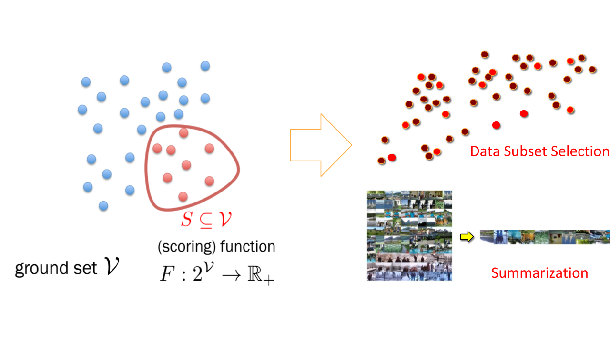
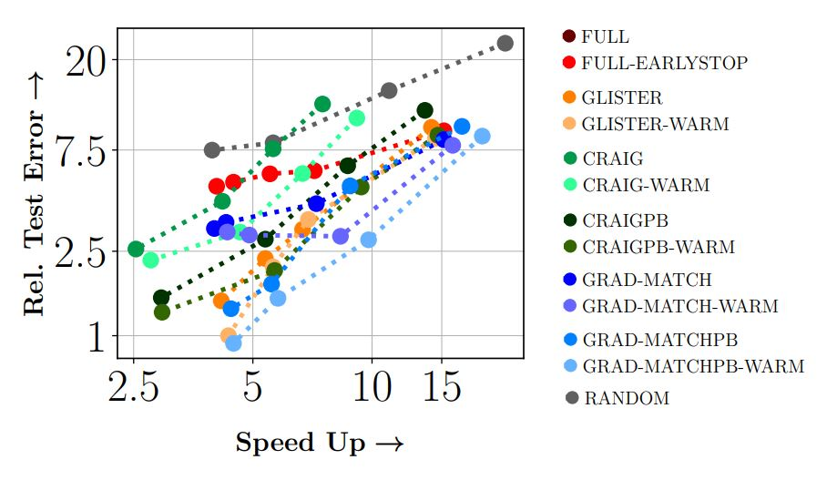
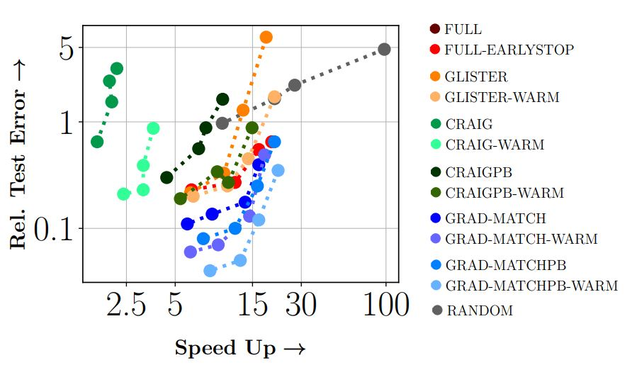
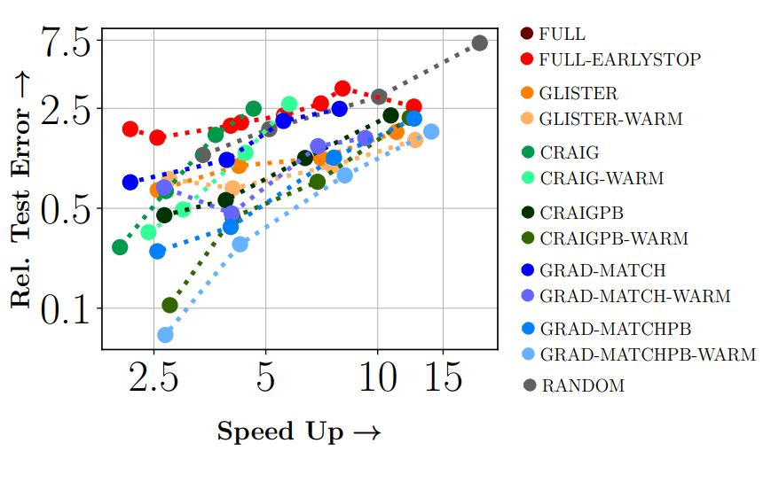
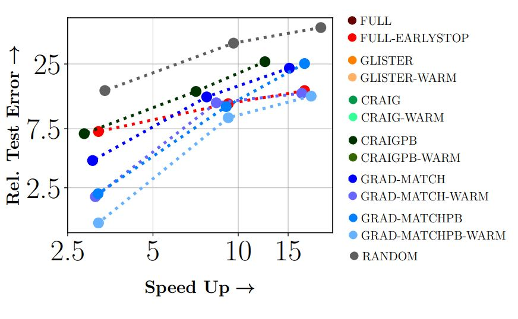

.. cords documentation master file, created by
   sphinx-quickstart on Tue Jan  5 14:29:55 2021.
   You can adapt this file completely to your liking, but it should at least
   contain the root `toctree` directive.

.. raw:: html

    

.. role:: red

*********************************
Welcome to CORDS's documentation!
*********************************

CORDS::COResets and Data Subset selection
==========================================
CORDS:: COResets and Data Subset slection is an efficient and scalable library for making machine learning time, energy, cost, and compute efficient
built on top of pytorch.

**Background:** Deep Learning systems are extremely compute-intensive today, with significant turnaround times, energy inefficiencies leading to
huge resource costs. Another aspect of deep learning systems is that they have a surprisingly large carbon footprint with lasting environmental
impacts(see https://arxiv.org/pdf/1907.10597.pdf and https://arxiv.org/abs/1906.02243 for more details on quantifications of these impacts).
Furthermore, to achieve the state of the art performances using deep learning models, we need to perform hyper-parameter tuning (which requires
training a deep learning model multiple times).

CORDS is an effort to make deep learning more energy, cost, resource and time efficient while not sacrificing accuracy.

The following are the goals CORDS tries to achieve:
       - Data Efficiency
       - Reducing End to End Training Time
       - Reducing Energy requirements
       - Reducing Hyper-parameter tuning turnaround time
       - Reducing Resource (GPU) requirements and Costs

CORDS' key idea is to use a subset of training data for model training. In this effort, CORDS incorporate various state-of-the-art data
selection strategies to select the proper representative data subset from massive datasets.

The selected subsets can be used for summarizing the dataset like finding the key parts of a video.

|

These subsets can also be used for training machine learning models for faster and efficient training.
It might seem counterintuitive at first to train a model using only a fraction of your data.
Unfortunately, the compute required to train models on huge data sets might not be available to everyone.

.. attention:: Training a Yolo V5X Model may take 8 days on a single V-100 GPU.

Instead of relying on random subsampling, one could instead select a subset using various data selection strategies.
The CORDS repository contains some of the state of the art data subset selection strategies that achieves close to full training accuracy even
when trained on a meager 10% subset of data while achieving significant speed ups.

.. image:: imgs/CIFAR100_test_accuracy.png
    :width: 1000px

|

.. note:: From the above figure, we can see that on CIFAR-10 dataset using RESNET18, GLISTER a data subset selection strategy
          achieves a :red:`6x speedup at 10%, 2.5x speedup at 30%, and 1.5x speedup at 50%`, while losing 3%, 1.2% and 0.2% in terms of accuracy compared to full training.

.. toctree::
   :maxdepth: 2
   :caption: Contents:

   strategies/modules

