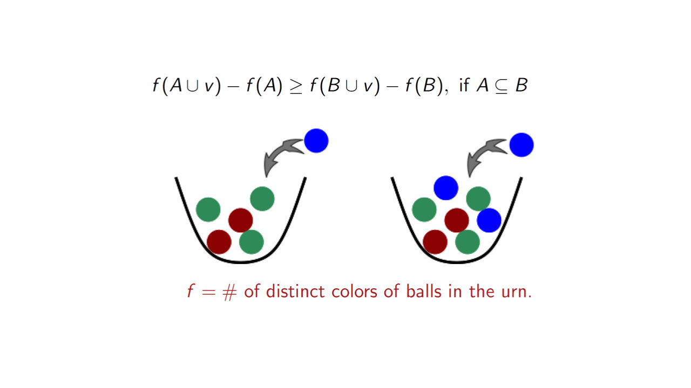
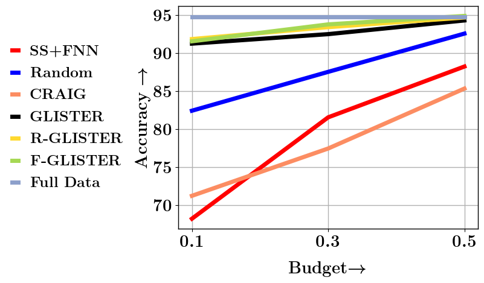
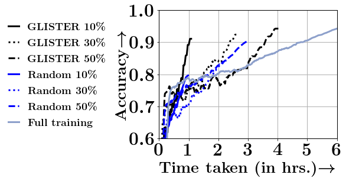

.. cords documentation master file, created by
   sphinx-quickstart on Tue Jan  5 14:29:55 2021.
   You can adapt this file completely to your liking, but it should at least
   contain the root `toctree` directive.

.. raw:: html

    

.. role:: red

*********************************
Welcome to CORDS's documentation!
*********************************

CORDS::COResets and Data Subset selection
==========================================
CORDS:: COResets and Data Subset selection is an efficient and scalable library for
data efficient machine learning built on top of pytorch.
The primary purpose of CORDS is to select the right representative data subset from massive datasets. We use submodularity based data selection strategies to select such subsets.

At a high level, submodular functions operate on sets of elements and optimizing them involves selecting a subset of elements. The functions implemented in apricot return a value that is inversely related to the redundancy of the selected elements, meaning that maximizing them involves selecting a set of non-redundant elements. A key property of these functions is that they are *submodular*, meaning that the gain in the function value that a particular element would yield either decreases or stays the same each time an element is added to the subset (this is also known as the diminishing returns property).

|

The selected subsets can be used for summarizing the dataset like finding the key parts of a video.

.. image:: imgs/cords_summary.png
   :width: 1000px

|

These subsets can also be used for training machine learning models for faster and efficient training.
It might seem counterintuitive at first to train a model using only a fraction of your data.
Unfortunately, the compute required to train models on huge data sets might not be available to everyone.

.. attention:: Training a Yolo V5X Model may take 8 days on a single V-100 GPU.

Instead of relying on random subsampling, one could instead select a subset using various data selection strategies.
The CORDS repo contains some of the state of the art data subset selection strategies that achieves close to full training accuracy even
when trained on a meager 10% subset of data while achieving significant speed ups.

|

.. note:: From the above figure, we can see that on CIFAR-10 dataset using RESNET18, GLISTER a data subset selection strategy
          achieves a :red:`6x speedup at 10%, 2.5x speedup at 30%, and 1.5x speedup at 50%`, while losing 3%, 1.2% and 0.2% in terms of accuracy compared to full training.

.. toctree::
   :maxdepth: 2
   :caption: Contents:

   strategies/modules

